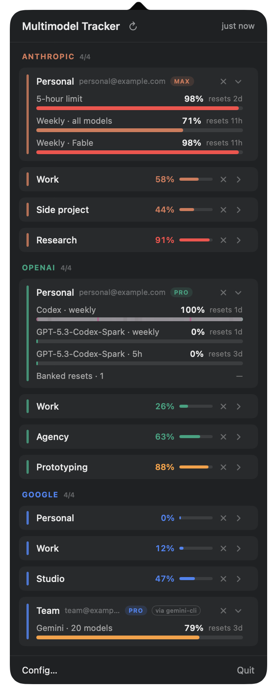
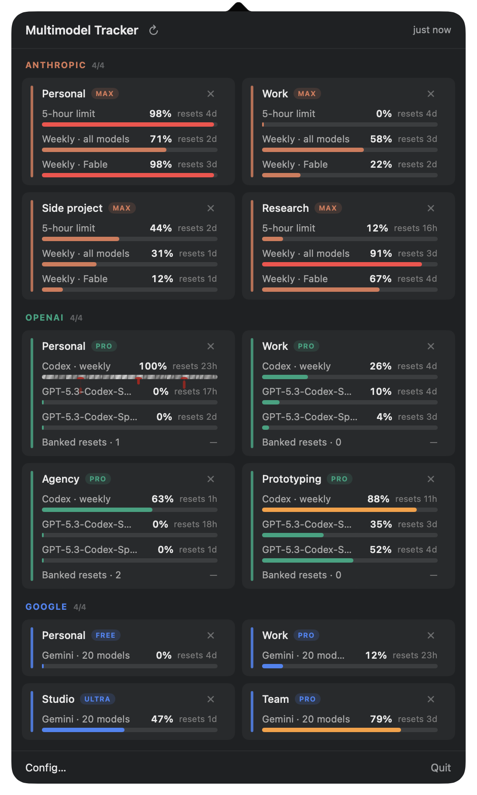
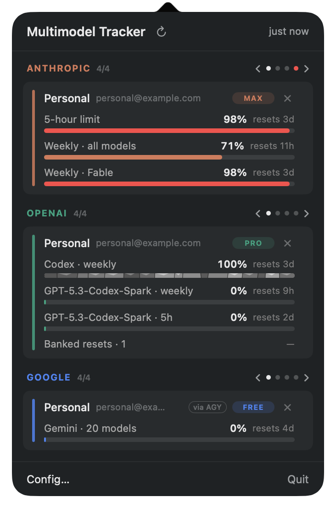
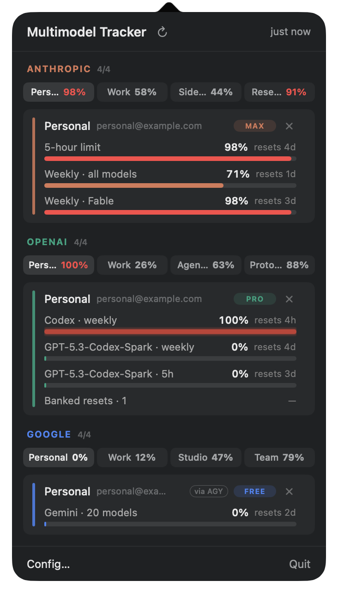

# Multimodel Tracker

A native macOS menu-bar app for watching usage limits across **several
subscriptions per vendor** — up to **4 accounts each** for Anthropic, OpenAI
and Google, side by side.

Existing trackers assume one login per provider. People who buy multiple
subscriptions can't see them together; that's the gap this fills.

The menu bar shows one compact badge per provider (`A25 O100 G0`) carrying
that vendor's *worst* pool — amber past 75%, red past 90% — so the numbers
are readable without opening anything. Click it for the full breakdown:
provider → account → pools, each pool with its percentage, bar and reset
time.

**If the menu bar is full** — on a notched MacBook, macOS hides third-party
items once the run between the notch and Control Center is used up — the
tracker is still one keystroke away: **⌃⌥U** opens it from anywhere (the
popover when the item is showing, a floating panel when it isn't), and
opening **Multimodel Tracker** from Spotlight or Applications shows your
usage the same way. Freeing space (System Settings → Control Center, hide a
few items) brings the badge back by itself.

Until the first numbers arrive the item shows a small gauge icon, so a fresh
install is identifiable; hovering it names the app either way. On the very
first launch the Config panel opens by itself so you can add accounts, and
at any later time — say the menu bar is crowded and macOS has hidden the
item — opening **Multimodel Tracker** from Applications or Spotlight brings
Config up again.

## What it looks like

A full house — twelve accounts, four per vendor — under each of the popover's
layouts. Every name, address and number below is fabricated demo data
(`--mock`), not anyone's real usage.

<p align="center">
  
  
</p>

**Roll-up rows** (left, the default) collapse each account to its nickname,
worst pool and a mini bar; click one to expand the full card, and the busiest
account per vendor starts open. **Two-up grid** (right) widens the popover and
lays a vendor's accounts side by side — one of three overflow layouts that
engage automatically when the popover would otherwise outgrow your screen.

<p align="center">
  
  
</p>

**Vendor pager** (left) shows one account per vendor at full size, with arrows
and dots in the header — a dot turns red when an account you can't see is past
90%. **Account tabs** (right) puts every account's worst pool in a tab strip.
Choose between them in **Config → Layout**, which previews each one against
your own accounts.

## Install / build

Requires macOS 14+ and Xcode command-line tools.

```bash
git clone https://github.com/dev-newb/multimodel-tracker.git
cd multimodel-tracker
./make-app.sh
```

Quit the app first if it is running from `build/`: the script refuses to overwrite a running bundle. A signed binary overwritten in place fails its own signature check, and the Keychain then refuses it until relaunch.

```bash
open "build/Multimodel Tracker.app"
```

`make-app.sh` builds with SwiftPM and signs with your Developer ID or Apple
Development certificate when one exists (selected by SHA-1 hash, never by
name — duplicate cert names are common and abort by-name selection). With no
certificate it falls back to ad-hoc signing, which works but re-prompts for
keychain access after every rebuild.

## Signing in

- **Anthropic** — per-account OAuth (the same "log in with your Claude
  account" flow Claude Code runs), in a sign-in window inside the tracker.
  The app keeps a refresh token per account, so four accounts stay signed in
  simultaneously. Signing in there rather than in your browser is what lets
  the tracker see **banked resets** — see below. **Use my browser instead**
  at the bottom of that window hands the same sign-in to your real browser
  (needed for Google sign-in and passkeys) at the cost of banked resets.
  Accounts from the old embedded-window flow keep working through their
  isolated cookie jars.
- **OpenAI** — either one-click **Import Codex CLI** (adopts `~/.codex/auth.json`)
  or per-account OAuth in your real browser (Codex CLI's flow). Legacy
  web-window accounts re-mint expired tokens silently from surviving cookies.
- **Google** — **Import Antigravity / gemini-cli**: the login already on your
  Mac *is* the credential. Antigravity mode reads the same grouped usage
  limits as the IDE's **View Usage** menu: Gemini and Claude/GPT, each with
  weekly and five-hour windows. The older Code Assist mode remains available
  for logins that do not expose Antigravity's grouped summary.

## Banked resets

A banked reset is a grant from the vendor that clears a usage limit on
demand — Codex hands them out as reset credits, and Anthropic has granted
them occasionally (one per Pro/Max account at a model launch, for instance).
When an account holds any, its card shows **Banked resets · N**, and the
banked-reset sound plays when N goes up. The tracker only ever *reads* them:
nothing in the app spends one. (claude.ai's own **Reset for free** button
does — that's the only way to use it.)

- **OpenAI** — nothing to do. Codex's usage endpoint reports them.
- **Google** — Antigravity reports no such thing.
- **Anthropic** — needs a claude.ai session, which is why sign-in happens
  in a window inside the tracker.

### Why Anthropic needs a second credential

Anthropic reports banked resets only to **claude.ai itself**. The OAuth
token that fetches your usage — the one Claude Code uses — is refused them
(the API answers `ineligible_reason: "surface"`). So to see them, the
tracker needs a claude.ai web session for that account as well.

That doesn't mean two logins. The sign-in window runs Anthropic's authorize
page in that account's own private cookie jar, so **one login leaves both
behind**: the OAuth token for usage, and the claude.ai session for resets.

A **second** login is needed only for an account that doesn't have the
session yet:

- **Accounts signed in before this version**, or through **Use my browser
  instead** — those logins happened in your browser, whose cookies the
  tracker can't and doesn't read. Such an account shows **See banked
  resets…** under its name in **Config → Anthropic**; click it and sign in
  once in the tracker's window.
- **Accounts that sign in with Google or a passkey** can't use the tracker's
  window (neither works in an embedded web view), so they get usage but not
  banked resets.

### How long it lasts

The claude.ai session cookie is issued for **28 days**. It looks like
claude.ai extends it as it's used — a session the tracker had been reading
for weeks still showed about 27 days left — which would mean it never lapses
while the tracker runs; that is still being confirmed. The tracker checks
for resets **every ten minutes**, not on every poll: they change on the
scale of days.

If the session does lapse, **only the banked-reset line goes**. Usage keeps
updating over OAuth, which renews itself separately. The account's **See
banked resets…** link comes back in Config; one sign-in restores it.

### Where the session lives

In that account's own WebKit data store, isolated from your browser and
from every other account, and deleted with the account. It is never written
to preferences or logs; `--web-session-probe` lists each account's cookie
*names* and expiry for diagnosis, never their values.

## Bar effects

Pools that are fully burned or burning fast get animated bars.

- **Dead (100%)**: flatline, glitch, bleed, dead channel, black hole, drown,
  petrify, neon burnout.
- **Burning** (usage climbing unusually fast): firestorm, coal bed,
  blowtorch, comet, fuse.

Burn detection is adaptive, ported from
[I'm Burning!](https://github.com/dev-newb/imburning): the jump is measured
over a 10-minute window against the pool's own historical rate
(median + 6·MAD), with an absolute 3-point floor, an 8-point fallback until
enough baseline exists, and a 45-minute afterglow with hysteresis so a pause
between prompts doesn't snuff the flames.

The Accounts window (▸ Accounts… in the popover) picks the animations: pin
one per category, cycle every 3rd view, or let every affected bar differ at
once.

## Why the providers need different machinery

**OpenAI — plain HTTPS.** `GET chatgpt.com/backend-api/wham/usage` with a
bearer token and `chatgpt-account-id`. Multiple accounts is just multiple
token pairs, stored per-account in the Keychain.

**Anthropic — OAuth first, browser engine for legacy.** Accounts signed in
through the browser hold an `api.anthropic.com` bearer token; that host's
usage endpoint answers a plain HTTPS GET with the same `limits[]` payload as
claude.ai's own, so polling needs no browser engine at all. Accounts from
the old embedded-window flow still poll claude.ai, which sits behind
Cloudflare and rejects plain HTTP client fingerprints — WebKit passes the
check (presenting an honest WebKit user agent is required; claiming to be
Chrome from a WebKit engine puts login into an unsolvable challenge loop).
Those accounts keep their *isolated cookie jars* — one
`WKWebsiteDataStore(forIdentifier:)` each.

**Google — borrowed credentials.** There is no public OAuth client for Code
Assist quota. The app reads the refresh token Antigravity (or gemini-cli)
already stores on your Mac and redeems it with the OAuth client embedded in
Antigravity's own binaries — a refresh token can only be redeemed by the
client that issued it, which is why borrowing gemini-cli's client against
Antigravity's token can never work.

## Security model

- **Tokens live in the login Keychain**, one item per account. Claude
  sessions live in per-account WebKit data stores. `UserDefaults` holds only
  labels, cached percentages and usage history — never credentials.
- Keychain items are read **once per launch** and cached in memory, so polls
  never touch the keychain. macOS will ask once for Antigravity's item
  (it belongs to another app); *Always Allow* makes it permanent.
- Refresh is staggered (250 ms per account) so twelve accounts don't hit
  three vendors in the same instant.
- Nothing leaves your machine except the providers' own API calls.

## Debug flags

| Flag | What it does |
|---|---|
| `--preview` | popover content in a normal window |
| `--open` / `--accounts` | open the popover / Accounts panel on launch |
| `--render-maxed <dir>` / `--render-burn <dir>` | render every bar effect to PNGs, offscreen |
| `--burn-sim` | run the burn detector against synthetic histories (6 rules, PASS/FAIL) |
| `--recover` | rebuild the account list from surviving keychain items and cookie jars |
| `--bridge-test` | probe the claude.ai page bridge |
| `--cursor-probe` | walk the pointer down the Config panel, report live cursor vs the governor's decision |
| `--loopback-test` | exercise the OAuth redirect catcher without a browser |
| `--google-raw` | dump Google's `loadCodeAssist` and `fetchAvailableModels` responses verbatim |
| `--usage-raw` | every account's pools with their **absolute** reset instants (the card rounds to "4h") |
| `--web-session-probe` | per Anthropic account: web-session mark, claude.ai cookie *names* and session expiry, banked-reset count — never cookie values |
| `--mock` | fill the app with 12 fabricated accounts (4 per vendor) for UI work — saves nothing, fetches nothing |
| `MMT_DEBUG=1` | log refreshes and window metrics to stderr |

## Layout

```
Models/     Domain.swift      Provider, Account, UsageLimit
            Store.swift       account CRUD, refresh, burn detector, persistence
Providers/  Adapter.swift     UsageAdapter protocol + OpenAI/Anthropic adapters
            OpenAIParser      wham/usage → UsageLimit
            OpenAIOAuth       browser OAuth, Codex CLI's client
            AnthropicOAuth    browser OAuth, Claude Code's client
            OAuthLoopback     shared PKCE material + loopback redirect catcher
            GoogleAdapter     Antigravity/gemini-cli credentials + quota
            WebSessionPool    legacy per-account WKWebView + Anthropic parser
Support/    Support.swift     Keychain wrapper, Codex CLI import
UI/         App.swift         status item, badges, popover, cursor governor,
                              debug flags
            PopoverView       provider → account → pools
            AccountsView      accounts + bar-effect preferences
            MaxedBar          the eight dead-bar treatments
            BurningBar        the five burning treatments
```
